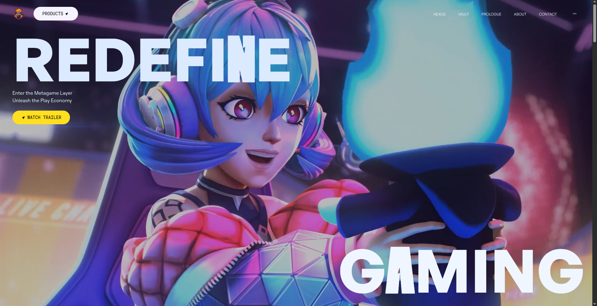

# Interactive Gaming UI Components

A modern React-based gaming interface featuring interactive video previews and animated hero sections using GSAP animations.


## Prerequisites

Make sure you have the following software installed on your machine:

-   **Node.js**: Latest LTS version
-   **npm**: The Node.js package manager

## Installation

1.  **Clone the repository:**
    ```bash
    git clone <repository-url>
    ```

2.  **Navigate to the project directory:**
    ```bash
    cd award-winning
    ```

3.  **Install the dependencies:**
    ```bash
    npm install
    ```

## Available Scripts

| Script        | Description                                     |
|---------------|-------------------------------------------------|
| `npm run dev` | Runs the app in development mode.               |
| `npm run build` | Builds the app for production.                  |
| `npm run lint`  | Lints the project files using ESLint.           |
